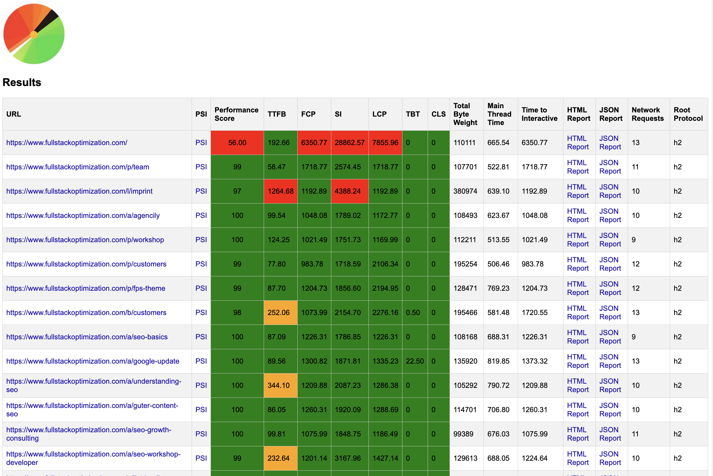
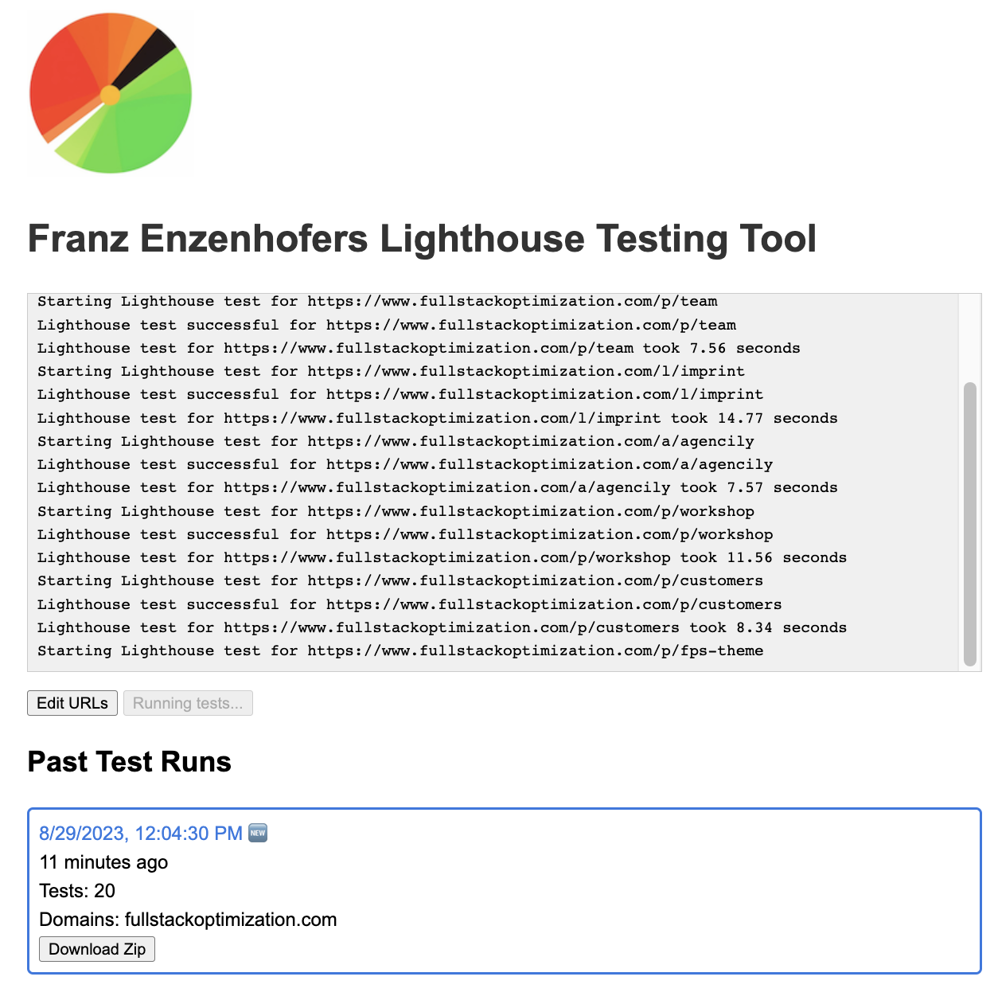
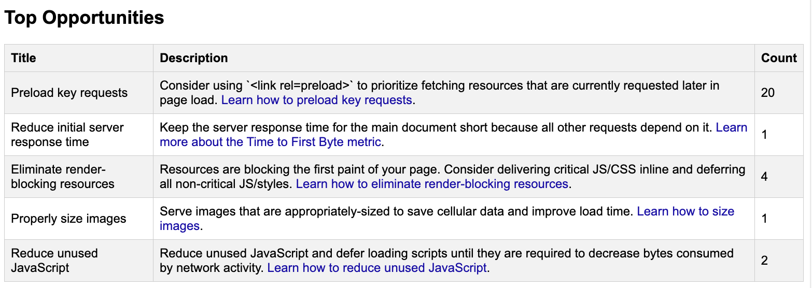

# Franz Enzenhofers Lighthouse Script

This is a Lighthouse script that automates performance tests for multiple webpages. It uses the Lighthouse library, Chrome Launcher, and Express for serving the results. The project allows users to read and write URLs, run Lighthouse tests, and view the results in a browser.

## Prerequisites

1. Node.js (version 14 or newer)
2. Google Chrome browser installed

## Installation

1. Clone the GitHub repository:

`git clone https://github.com/franzenzenhofer/lighthouse-script.git`

2. Change to the project directory:

`cd lighthouse-script`

3. Install the required dependencies:

`npm install`

## How to Run

1. Start the script by running the following command:

`node main.js`

2. The script will launch a local server at `http://localhost:3000`. Open this address in your browser to view the Lighthouse test results.

3. To add or edit URLs for testing, go to `http://localhost:3000/urls-editor`. Edit the URLs and save your changes.

4. To rerun the tests for the updated URLs, click the "Rerun Tests" button on the main page.

- Delete Previous Results To delete all previous results and start with a clean slate, run: `npm run cleanRun.js`

## Contributing

If you have any suggestions or improvements, feel free to create a fork and submit a pull request on the GitHub repository.

## License

License: This project is licensed under the MIT License - see the LICENSE.md file for details.

---

Just place the images (`overview.png`, `detailed-results.png`, and `recommendations.png`) in the same directory as the `README.md` file, and the Markdown syntax will correctly display them when viewed on GitHub or any Markdown renderer.